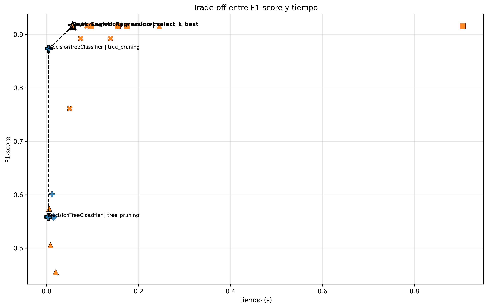

# transport-ml-rd


Machine Learning aplicado al dominio del transporte utilizando Support Vector Machines (SVM) y análisis de eficiencia bajo el enfoque **Green AI**.

---

## 📌 Descripción

Este repositorio contiene la implementación de modelos de clasificación aplicados a un escenario del sector transporte en la República Dominicana.

El proyecto evoluciona en dos fases:

- **Práctica 2:** Implementación base con SVM y pipeline de clasificación  
- **Práctica 3:** Extensión hacia un análisis de eficiencia computacional (Green AI)

Se desarrolla un flujo completo de machine learning, desde el preprocesamiento hasta el análisis comparativo de modelos.

---

## 📓 Notebooks del proyecto

El proyecto incluye dos notebooks principales que representan la evolución del análisis:

### 🔹 Práctica 2 – Modelo Base (SVM)

Implementación inicial del pipeline de clasificación utilizando Support Vector Machines.

- Preprocesamiento completo  
- Entrenamiento del modelo SVM  
- Evaluación con métricas estándar  

👉 Ejecutar en Colab:  
[](https://colab.research.google.com/drive/1w8aF5fVg4bdfoBsr6w0-9BQhnkPvYCa7?usp=sharing)

---

### 🔹 Práctica 3 – Green AI y Trade-off

Extensión del análisis hacia eficiencia computacional:

- Comparación entre múltiples modelos  
- Evaluación de estrategias de optimización  
- Análisis de trade-off (F1 vs tiempo)  
- Frontera de Pareto  
- Detección del mejor modelo global  

👉 Ejecutar en Colab:  
[](https://colab.research.google.com/drive/18ifzCj4s-Kq-NQEJlLTLI25IR3rDIsfS?usp=sharing)

## 🎯 Objetivos

- Implementar modelos de clasificación supervisada (SVM y otros)
- Aplicar técnicas de preprocesamiento sobre datos estructurados
- Evaluar modelos mediante métricas estándar
- Analizar sobreajuste, interpretabilidad y coste computacional
- Evaluar el **trade-off entre desempeño y eficiencia (Green AI)**

---

## 🧠 Práctica 2 – Modelo Base (SVM)

### Algoritmo

**Support Vector Machine (SVM)**

Configuración principal:

- Kernel: RBF  
- Parámetro de regularización: C  
- Parámetro del kernel: gamma  

Se selecciona por:

- Maximización del margen de separación  
- Capacidad para modelar relaciones no lineales  
- Base teórica sólida  

---

## 🌱 Práctica 3 – Enfoque Green AI

Se extiende el análisis hacia eficiencia computacional, evaluando:

- tiempo de entrenamiento  
- número de features (`n_features`)  
- tamaño de muestra (`sample_fraction`)  
- impacto de estrategias de optimización  

### Estrategias evaluadas

- Regularización  
- Selección de variables (SelectKBest)  
- Reducción de profundidad en árboles  
- Reducción del tamaño de muestra  

---

## 📊 Análisis de Trade-off

Se construye una figura tipo paper que representa:

- F1-score ponderado vs tiempo de entrenamiento  
- Diferenciación por modelo (color)  
- Diferenciación por estrategia (marcador)  
- **Frontera de Pareto**  
- **Detección automática del mejor modelo global**

Los resultados se exportan automáticamente:

```text
reports/figures/
├── figure_1_tradeoff.png
├── figure_1_tradeoff.pdf
├── figure_1_tradeoff.svg
├── figure_1_tradeoff_metadata.json

🗺️ Normalización de unidades territoriales

Se detectó una inconsistencia en la variable provincia:

63 valores únicos iniciales ❌
32 unidades territoriales reales (31 provincias + Distrito Nacional) ✅

Se aplicó un proceso de normalización para:

eliminar diferencias en capitalización
eliminar tildes
unificar representación textual

Este paso es crítico para garantizar la validez del análisis territorial.

⚙️ Pipeline

El flujo de trabajo implementado es:

Carga de datos
Limpieza y preprocesamiento
Normalización territorial
Ingeniería de características
Entrenamiento de modelos
Evaluación de métricas
Análisis Green AI

📄 Documentación completa:

👉 Data Pipeline

📈 Métricas de Evaluación
Accuracy
Precision
Recall
F1-score
ROC AUC
Matriz de confusión

🧪 Resultados

El pipeline genera automáticamente:

métricas de entrenamiento y prueba
reportes de clasificación
matriz de confusión
curva ROC
tiempos de entrenamiento
comparación entre configuraciones
⚠️ Análisis
Sobreajuste

Comparación entre métricas de entrenamiento y prueba.

Interpretabilidad

Limitaciones de modelos como SVM.

Coste Computacional

Evaluación del tiempo de entrenamiento como métrica clave en Green AI.

## 📊 Visualización del Trade-off (Green AI)

La figura muestra la relación entre desempeño (F1-score ponderado) y costo computacional (tiempo de entrenamiento), incorporando:

- diferenciación por modelo (color)
- diferenciación por estrategia (marcador)
- frontera de Pareto
- mejor modelo global identificado automáticamente



📁 Estructura del Proyecto
transport-ml-rd/
│
├── docs/
│   └── data_pipeline.md
│
├── data/
├── notebooks/
├── reports/
│   ├── tables/
│   └── figures/
├── src/
├── tests/
│
├── README.md
├── main.py
├── requirements.txt

⚙️ Instalación

git clone https://github.com/your-username/transport-ml-rd.git
cd transport-ml-rd
pip install -r requirements.txt

▶️ Ejecución

python main.py

## ▶️ Ejecutar en Google Colab

[](https://colab.research.google.com/drive/18ifzCj4s-Kq-NQEJlLTLI25IR3rDIsfS?usp=sharing)

📌 Conclusión

El proyecto demuestra que:

el desempeño del modelo no debe evaluarse de forma aislada
el coste computacional es un factor clave
el análisis de trade-offs permite seleccionar modelos más eficientes
la calidad de los datos (ej. normalización territorial) impacta directamente los resultados

👤 Autor

Edwin José Nolasco

## 📚 Referencias

- Cortes, C., & Vapnik, V. (1995). Support-vector networks.  
- Bishop, C. M. (2006). Pattern Recognition and Machine Learning.  
- Scikit-learn documentation: https://scikit-learn.org/
- Awad, M., & Khanna, R. (2015). Support vector machines for classification. In Efficient learning machines (pp. 39–66). Apress. https://doi.org/10.1007/978-1-4302-5990-9_3
- Cervantes, J., García-Lamont, F., Rodríguez-Mazahua, L., & López, A. (2020). A comprehensive survey on support vector machine classification: Applications, challenges and trends. Neurocomputing, 408, 189–215. https://doi.org/10.1016/j.neucom.2019.10.118
- Guido, R. (2024). An overview on the advancements of support vector machines in medical applications. Information, 15(4), 235. https://doi.org/10.3390/info15040235
- Khyathi, G., Prasad, K., & Reddy, K. (2025). Support vector machines: A literature review on their application in analyzing mass data for public health. Cureus, 17(1), e77169. https://doi.org/10.7759/cureus.77169 
- Schwartz, R., Dodge, J., Smith, N. A., & Etzioni, O. (2020). Green AI. Communications of the ACM, 63(12), 54–63. https://doi.org/10.1145/3381831
- Tang, W. (2024). Application of support vector machine system introducing cluster-based kernel methods. Machine Learning with Applications, 15, 100525. https://doi.org/10.1016/j.mlwa.2024.100525 

## English Version

### Description

This repository contains a classification model based on **Support Vector Machines (SVM)**, developed as part of a Machine Learning course.

The project focuses on a transport-related scenario, where the objective is to classify risk levels using structured data. A full machine learning pipeline is implemented, including preprocessing, training, and evaluation.

---

### Objectives

- Implement a supervised classification model using SVM  
- Apply preprocessing techniques to structured data  
- Evaluate model performance using standard metrics  
- Analyze overfitting, interpretability, and computational cost  
- Prepare the project for Green AI optimization  

---

### Algorithm

- Model: Support Vector Machine (SVM)  
- Kernel: RBF  
- Hyperparameters: C, gamma  

---

### Evaluation

Metrics used:

- Accuracy  
- Precision  
- Recall  
- F1-score  
- Confusion Matrix  
- ROC Curve  

---

### Future Work

- Dataset size variation  
- Feature reduction  
- Runtime analysis  
- Model optimization techniques  

---

### Notes

This repository is developed strictly for academic purposes.


